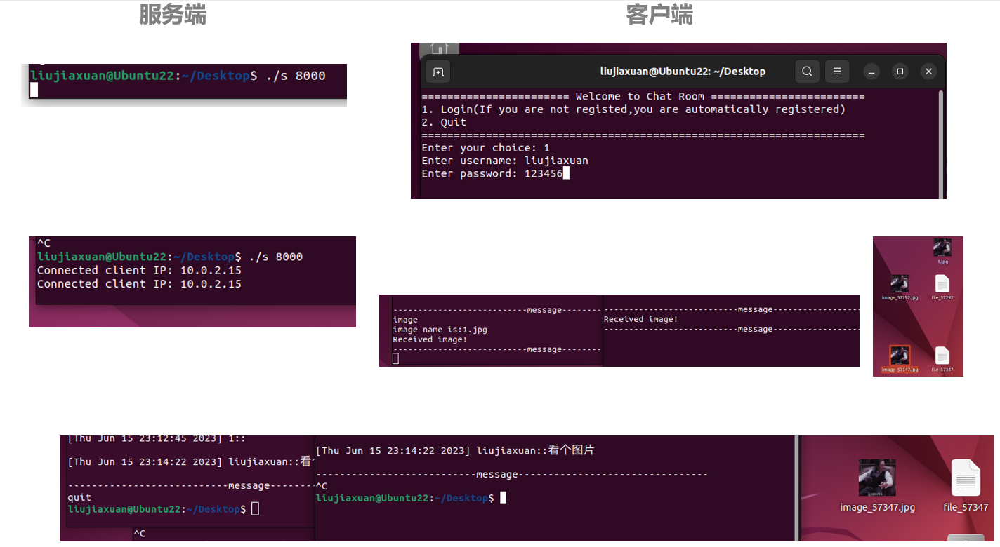
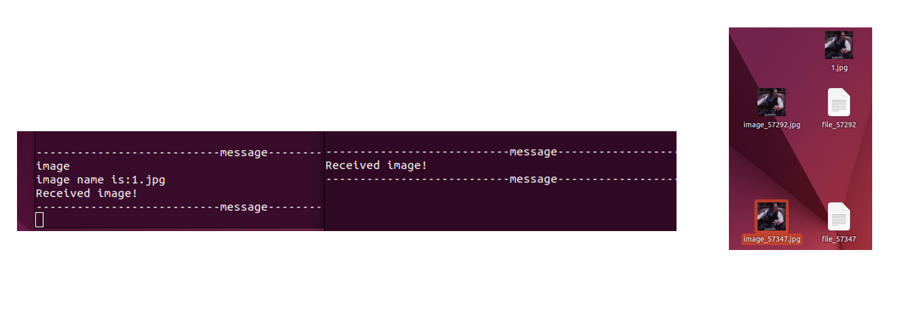

# Linux聊天室（C语言版本）
### Linux简易的聊天室系统（简单版，仅供学习参考）
* 使用socket套接字通信
* 通过多线程实现并发
-----
### 基本功能
* 多客户端的群聊
* 简单的图片发送
* 显示用户的名称和发送时间

-----
### 运行:
运行环境: Ubuntu 16.04
```
git clone https://github.com/WPF196/Chat_Room.git
cd Chat_Room
gcc chat_serv.c -o serv -lpthread
gcc char_clnt.c -o clnt -lpthread

./serv [port]
./cntl [IP] [port] [name]
```
-----
### 运行结果

